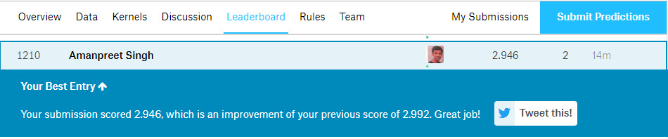

# nyc-taxi

## Overview

This is the code for <a href="https://www.kaggle.com/c/LANL-Earthquake-Prediction">this</a> Kaggle competition.

## Software and Libraries
- Python 3
- Scikit-learn: Python’s open source machine learning library
- catboost
- matplotlib(for visualization)

## Dataset
The dataset used for the challenge can be found at the <a href="https://www.kaggle.com/c/LANL-Earthquake-Prediction/data">Kaggle competition website</a>

## Kaggle Rank as of today(24 Feb 2019 1:00 pm)

## Future ideas to make it better
- RNNs
- Genetic algorithms
- Ordinary Differential Equation Networks (YOOOOOO)

## Credits
<a href="https://github.com/llSourcell/Kaggle_Earthquake_challenge">Siraj Raval</a>